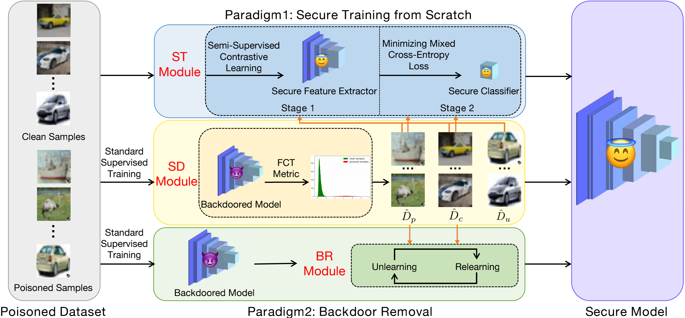

# Effective Backdoor Defense by Exploiting Sensitivity of Poisoned Samples
This repository is the official implementation of Effective Backdoor Defense by Exploiting Sensitivity of Poisoned Samples.



We propose two effective backdoor defense methods for training a secure model from scratch (**D-ST**) and removing backdoor from the backdoored model (**D-BR**), respectively. D-ST consists of two modules: the SD module and the ST module. D-BR includes two modules: the SD module and the BR module. **SD module** distinguishes samples according to the FCT metric and separates training samples into clean samples, poisoned samples and uncertain samples. **ST module** firstly trains a secure feature extractor via semi-supervised contrastive learning and then trains a secure classifier by minimizing a mixed cross-entropy loss. **BR module** removes backdoor by unlearning the distinguished poisoned samples and relearning the distinguished clean samples.


## Environment
This code is implemented in PyTorch, and we have tested the code under the following environment settings:
- python = 3.8.8
- torch = 1.7.1
- torchvision = 0.8.2
- tensorflow = 2.4.1


## Default Configurations
The default configurations are as follows:
- dataset = cifar10
- model = resnet18
- poison_rate = 0.10
- target_type = all2one
- trigger_type = gridTrigger

You might change the configurations to apply our method in different settings. Note that the attacks used in our paper correspond to the following configurations:
| Attack                        | target_type | trigger_type           |
|:-----------------------------:|:-----------:|:----------------------:|
| BadNets-all2one               | all2one     | gridTrigger            |
| BadNets-all2all               | all2all     | squareTrigger          |
| Trojan                        | all2one     | trojanTrigger          |
| Blend-Strip                   | all2one     | signalTrigger          |
| Blend-Kitty                   | all2one     | kittyTrigger           |
| SIG                           | cleanLabel  | sigTrigger             |
| CL                            | cleanLabel  | fourCornerTrigger      |
| SSBA                          | all2one     | SSBA                   |
| BadNets-all2one (on ImageNet) | all2one     | squareTrigger_imagenet |
| Blend-Strip (on ImageNet)     | all2one     | signalTrigger_imagenet |


## Performance
Results on CIFAR-10:
<table>
	<tr>
	    <td>CIFAR-10</th>
	    <td colspan="2">Backdoored</th>
	    <td colspan="2" >D-BR</th>  
	    <td colspan="2" >D-ST</th>
	</tr >
	<tr >
	    <td>Attack</td>
	    <td>ACC</td>
	    <td>ASR</td>
	    <td>ACC</td>
	    <td>ASR</td>
            <td>ACC</td>
	    <td>ASR</td>
	</tr>
	<tr >
	    <td>BadNets-all2one</td>
	    <td>91.64</td>
	    <td>100.00</td>
	    <td>92.83</td>
	    <td>0.40</td>
	    <td>92.77</td>
	    <td>0.03</td>
	</tr>
	<tr >
	    <td>BadNets-all2all</td>
	    <td>92.79</td>
	    <td>88.01</td>
	    <td>92.61</td>
	    <td>0.56</td>
	    <td>89.22</td>
	    <td>2.05</td>
	</tr>
	<tr >
	    <td>Trojan</td>
	    <td>91.91</td>
	    <td>100.00</td>
	    <td>92.21</td>
	    <td>0.76</td>
	    <td>93.72</td>
	    <td>0.00</td>
	</tr>
	<tr >
	    <td>Blend-Strip</td>
	    <td>92.09</td>
	    <td>99.97</td>
	    <td>92.40</td>
	    <td>0.06</td>
	    <td>93.59</td>
	    <td>0.00</td>
	</tr>
	<tr >
	    <td>Blend-Kitty</td>
	    <td>92.69</td>
	    <td>99.99</td>
	    <td>92.11</td>
	    <td>0.14</td>
	    <td>91.82</td>
	    <td>0.00</td>
	</tr>
	<tr >
	    <td>SIG</td>
	    <td>92.88</td>
	    <td>99.69</td>
	    <td>92.73</td>
	    <td>0.24</td>
	    <td>90.07</td>
	    <td>0.00</td>
	</tr>
	<tr >
	    <td>CL</td>
	    <td>93.20</td>
	    <td>93.34</td>
	    <td>92.08</td>
	    <td>0.00</td>
	    <td>90.46</td>
	    <td>6.40</td>
	</tr>
</table>

Results on CIFAR-100:
<table>
	<tr>
	    <td>CIFAR-100</th>
	    <td colspan="2">Backdoored</th>
	    <td colspan="2" >D-BR</th>  
	    <td colspan="2" >D-ST</th>
	</tr >
	<tr >
	    <td>Attack</td>
	    <td>ACC</td>
	    <td>ASR</td>
	    <td>ACC</td>
	    <td>ASR</td>
            <td>ACC</td>
	    <td>ASR</td>
	</tr>
	<tr >
	    <td>BadNets-all2one</td>
	    <td>71.23</td>
	    <td>99.13</td>
	    <td>72.58</td>
	    <td>0.25</td>
	    <td>68.43</td>
	    <td>0.12</td>
	</tr>
	<tr >
	    <td>Trojan</td>
	    <td>75.75</td>
	    <td>100.00</td>
	    <td>74.52</td>
	    <td>0.00</td>
	    <td>68.04</td>
	    <td>0.08</td>
	</tr>
	<tr >
	    <td>Blend-Strip</td>
	    <td>75.54</td>
	    <td>99.99</td>
	    <td>74.35</td>
	    <td>0.00</td>
	    <td>67.63</td>
	    <td>0.00</td>
	</tr>
	<tr >
	    <td>Blend-Kitty</td>
	    <td>75.18</td>
	    <td>99.97</td>
	    <td>72.00</td>
	    <td>0.01</td>
	    <td>67.06</td>
	    <td>0.00</td>
	</tr>
</table>

Results on ImageNet Subset:
<table>
	<tr>
	    <td>ImageNet</th>
	    <td colspan="2">Backdoored</th>
	    <td colspan="2" >D-BR</th>  
	</tr >
	<tr >
	    <td>Attack</td>
	    <td>ACC</td>
	    <td>ASR</td>
	    <td>ACC</td>
	    <td>ASR</td>
	</tr>
	<tr >
	    <td>BadNets-all2one</td>
	    <td>84.72</td>
	    <td>95.80</td>
	    <td>83.66</td>
	    <td>0.00</td>
	</tr>
	<tr >
	    <td>Blend-Strip</td>
	    <td>84.36</td>
	    <td>97.64</td>
	    <td>80.40</td>
	    <td>0.00</td>
	</tr>
	<tr >
	    <td>Blend-Kitty</td>
	    <td>85.46</td>
	    <td>99.68</td>
	    <td>84.29</td>
	    <td>0.00</td>
	</tr>
	<tr >
	    <td>SSBA</td>
	    <td>85.24</td>
	    <td>99.64</td>
	    <td>83.77</td>
	    <td>0.09</td>
	</tr>
</table>


## Sample-Distinguishment (SD) Module
**Step1: Train a backdoored model without any data augmentations.**
```
python train_attack_noTrans.py --dataset cifar10 --model resnet18 --trigger_type gridTrigger --epochs 2
```
Models of each epoch are saved at *"./saved/backdoored_model/poison_rate_0.1/noTrans/cifar10/resnet18/gridTrigger"*.

**Step2: Fine-tune the backdoored model with intra-class loss $\mathcal{L}_{intra}$.**
```
python finetune_attack_noTrans.py --dataset cifar10 --model resnet18 --trigger_type gridTrigger --epochs 10 --checkpoint_load ./saved/backdoored_model/poison_rate_0.1/noTrans/cifar10/resnet18/gridTrigger/1.tar
```
This step aims to enlarge the distance between genuinely clean samples with target class and genuinely poisoned samples.

*--checkpoint_load* specifies the path of the backdoored model.

Models of each epoch are saved at *"./saved/backdoored_model/poison_rate_0.1/noTrans_ftsimi/cifar10/resnet18/gridTrigger"*.

**Step3: Calculate the values of the FCT metric ($\Delta_{trans}(x;\tau,f)$) for all training samples.**
```
python calculate_consistency.py --dataset cifar10 --model resnet18 --trigger_type gridTrigger --checkpoint_load ./saved/backdoored_model/poison_rate_0.1/noTrans_ftsimi/cifar10/resnet18/gridTrigger/9.tar
```
*--checkpoint_load* specifies the path of the fine-tuned model.

$\Delta_{trans}(x;\tau,f)$ of all training samples are saved at *"./saved/backdoored_model/poison_rate_0.1/noTrans_ftsimi/cifar10/resnet18/gridTrigger/9_all.txt"*.
Besides, $\Delta_{trans}(x,\tau,f)$ of genuinely clean samples are saved as *"9_clean.txt"*, while those of genuinely poisoned samples are saved as *"9_poison.txt"*. They are used in the following visualization step.

If you want to visualize values of the FCT metric, you can run:
```
python visualize_consistency.py --dataset cifar10 --model resnet18 --trigger_type gridTrigger --checkpoint_load ./saved/backdoored_model/poison_rate_0.1/noTrans_ftsimi/cifar10/resnet18/gridTrigger/9.tar
```
The resulting figure is saved as *"9.jpg"* and shown as:


**Step4: Calculate thresholds for choosing clean and poisoned samples.**
```
python calculate_gamma.py --clean_ratio 0.20 --poison_ratio 0.05 --checkpoint_load ./saved/backdoored_model/poison_rate_0.1/noTrans_ftsimi/cifar10/resnet18/gridTrigger/9.tar 
```
In this step, you obtain two values, $\gamma_c$ and $\gamma_p$, which are used in the next step as gamma_low and gamma_high, respectively.

*--clean_ratio* and *--poison_ratio* specify $\alpha_c$ and $\alpha_p$, respectively.
*--checkpoint_load* specifies the path of the fine-tuned model.

**Step5: Separate training samples into clean samples $\hat{D}_c$, poisoned samples $\hat{D}_p$ and uncertain samples $\hat{D}_u$**
```
python separate_samples.py --dataset cifar10 --model resnet18 --trigger_type gridTrigger --batch_size 1 --clean_ratio 0.20 --poison_ratio 0.05 --gamma_low 0.0 --gamma_high 19.71682357788086 --checkpoint_load ./saved/backdoored_model/poison_rate_0.1/noTrans_ftsimi/cifar10/resnet18/gridTrigger/9.tar
```
*--gamma_low* and *--gamma_high* specify $\gamma_c$ and $\gamma_p$, respectively, which are derived from the former step.
*--checkpoint_load* specifies the path of the fine-tuned model.

The separated samples are saved at *"./saved/separated_samples/cifar10/resnet18/gridTrigger_0.2_0.05"*. Specifically, $\hat{D}_c$ is saved as *"clean_samples.npy"*. $\hat{D}_p$ is saved as *"poison_samples.npy"*. $\hat{D}_u$ is saved as *"suspicous_samples.npy"*. 


## two-stage Secure Training (ST) Module
```
cd ST
```

**Step1: Train the feature extractor via semi-supervised contrastive learning.**
```
python train_extractor.py --dataset cifar10 --model resnet18 --trigger_type gridTrigger --epochs 200 --learning_rate 0.5 --temp 0.1 --cosine --save_freq 20 --batch_size 512
```
Parameters are set as the same in [Supervised Contrastive Learning](https://proceedings.neurips.cc/paper/2020/file/d89a66c7c80a29b1bdbab0f2a1a94af8-Paper.pdf) (https://github.com/HobbitLong/SupContrast).

Checkpoints are saved at *"./save/poison_rate_0.1/SupCon_models/cifar10/resnet18/gridTrigger_0.2_0.05/SupCon_cifar10_resnet18_lr_0.5_decay_0.0001_bsz_512_temp_0.1_trial_0_cosine_warm"*.

**Step2: Train the classifier via minimizing a mixed cross-entropy loss.**
```
python train_classifier.py --dataset cifar10 --model resnet18 --trigger_type gridTrigger --epochs 10 --learning_rate 5 --batch_size 512 --ckpt ./save/poison_rate_0.1/SupCon_models/cifar10/resnet18/gridTrigger/SupCon_cifar10_resnet18_lr_0.5_decay_0.0001_bsz_512_temp_0.1_trial_0_cosine_warm/last.pth
```
Parameters are set as the same in Supervised Contrastive Learning.
*--ckpt* specifies the path of the trained feature extractor.

Checkpoints are saved at *"./save/poison_rate_0.1/SupCon_models/cifar10/resnet18/gridTrigger_0.2_0.05/Linear_cifar10_resnet18_lr_5.0_decay_0_bsz_512"*.

**Step3: Test the final model.**
```
python test.py --dataset cifar10 --model resnet18 --trigger_type gridTrigger --model_ckpt ./save/poison_rate_0.1/SupCon_models/cifar10/resnet18/gridTrigger/SupCon_cifar10_resnet18_lr_0.5_decay_0.0001_bsz_512_temp_0.1_trial_0_cosine_warm/last.pth --classifier_ckpt ./save/poison_rate_0.1/SupCon_models/cifar10/resnet18/gridTrigger/Linear_cifar10_resnet18_lr_5.0_decay_0_bsz_512/ckpt_epoch_9.pth
```
*--model_ckpt* and *--classifier_ckpt* specify the path of the trained feature extractor and classifier, respectively. 


## Backdoor Removal (BR) Module
**Step1: Train a backdoored model with classical data augmentations.**

If you use cifar10 or cifar100 as the dataset, please run the following command.
```
python train_attack_withTrans.py --dataset cifar10 --model resnet18 --trigger_type gridTrigger --epochs 200
```
Models of each epoch are saved at *"./saved/backdoored_model/poison_rate_0.1/withTrans/cifar10/resnet18/gridTrigger"*.
Note that you can refer to https://github.com/weiaicunzai/pytorch-cifar100 if you want the accuracy of the model trained on cifar100 is higher.

If you use imagenet as the dataset, please run the following command.
```
python train_attack_withTrans_imagenet.py --dataset imagenet --model resnet18 --trigger_type squareTrigger_imagenet --epochs 25 --lr 0.001 --gamma 0.1 --schedule 15 20
```
Models of each epoch are saved at *"./saved/backdoored_model/poison_rate_0.1/withTrans/imagenet/resnet18/squareTrigger_imagenet"*.

**Step2: Unlearn and relearn the backdoored model.**
```
python unlearn_relearn.py --dataset cifar10 --model resnet18 --trigger_type gridTrigger --epochs 20 ---clean_ratio 0.20 --poison_ratio 0.05 -checkpoint_load ./saved/backdoored_model/poison_rate_0.1/withTrans/cifar10/resnet18/gridTrigger/199.tar --checkpoint_save ./saved/backdoored_model/poison_rate_0.1/withTrans/cifar10/resnet18/gridTrigger/199_unlearn_purify.py --log ./saved/backdoored_model/poison_rate_0.1/withTrans/cifar10/resnet18/gridTrigger/unlearn_purify.csv
```
This step unlearns $D_p$ and relearns $D_c$.

*--checkpoint_load* specifies the path of the backdoored model. *--checkpoint_save* specifies the path to save the model. *--log* specifies the path to record.


## Implementation Tips for Some Attacks
### CL Attack
If you want to run the CL attack, you need to train a clean model first. Please use the following command.
```
python train_clean_withTrans.py --dataset cifar10 --model resnet18 --epochs 200
```
Models of each epoch are saved at *"./saved/benign_model/cifar10/resnet18"*.

### SSBA Attack
If you want to run the SSBA attack, please use the following annotated code in dataloader_bd.py.
```
from utils.SSBA.encode_image import bd_generator
```
You also need to refer to https://github.com/SCLBD/ISSBA to download the encoder for imagenet and save it at *"./trigger/imagenet_encoder/saved_model.pb"*.
